# NOUR — Social Robot: Embedded & Electrical + Control & Navigation 🤖🔧

Embedded and electrical system, firmware, and autonomous navigation stack for NOUR — an indoor social robot built at Zewail City of Science and Technology. The robot integrates a Teensy 3.2, Arduino emergency stop, and Nvidia Jetson running ROS for SLAM-based navigation, PID motor control, and IMU-fused odometry.

<div align="center">
  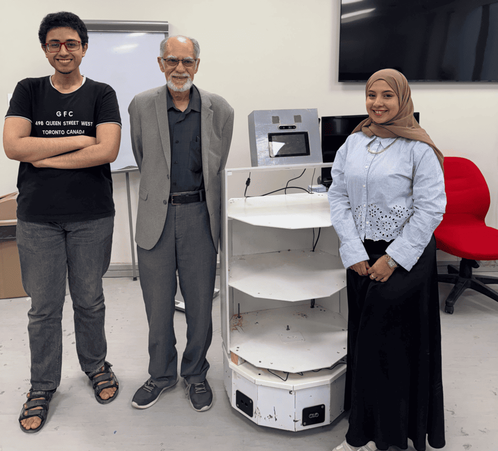
</div>

<br>
<div align="center">
  <a href="https://codeload.github.com/TendoPain18/nour-robot-embedded-navigation/legacy.zip/main">
    
  </a>
</div>

## 📋 Description

NOUR is an indoor autonomous social robot designed for environments such as malls and hospitals. This repository covers the **Embedded & Electrical** and **Control & Navigation** subsystems, including all firmware, circuit design, ROS node architecture, SLAM-based mapping and localization, and a custom single-button boot sequence.

The robot was built and tested at the IRES lab in Zewail City of Science and Technology and successfully achieved autonomous navigation, real-time SLAM mapping, obstacle avoidance, and stable motor control.

## 🏗️ System Architecture

The system is split across three compute nodes connected via ROS Serial:

- **Arduino** — Emergency stop system using 3× HC-SR04 ultrasonic sensors and relay output
- **Teensy 3.2** — Core motion controller: drives DC motors via dual motor drivers, reads encoders and MPU6050 IMU, controls LED strips, communicates over ROS Serial
- **Nvidia Jetson (main hub)** — Runs ROS Melodic, hosts all high-level nodes; connected to RPLIDAR, Intel RealSense camera, speaker, and microphone via USB

<div align="center">
  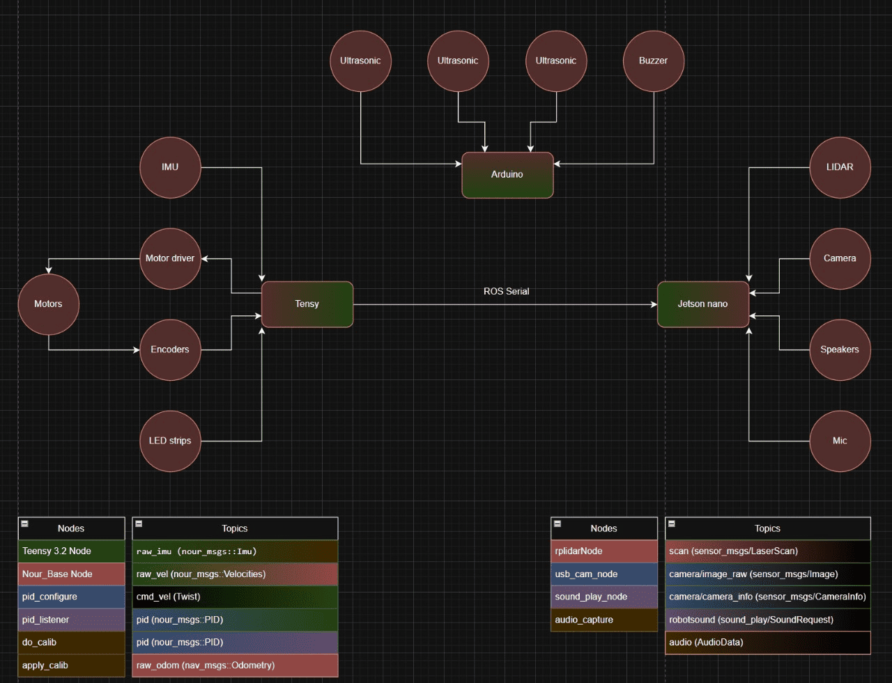
</div>

## ⚡ Hardware

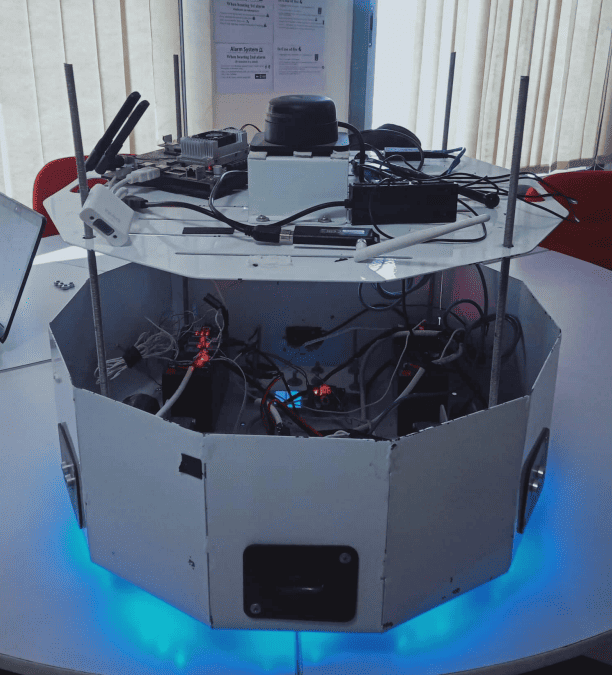

| Component | Role |
|-----------|------|
| Nvidia Jetson TX2 | Main computing hub, runs ROS Melodic |
| PJRC Teensy 3.2 | Motion controller — motors, encoders, IMU, LED |
| Arduino UNO | Emergency stop — ultrasonic sensors + relay |
| Slamtec RPLIDAR A2M8 | 2D 360° LiDAR for SLAM and obstacle detection |
| Intel RealSense D435 | Depth camera for object detection |
| MPU6050 IMU | 6-axis orientation and acceleration |
| Cytron 10A Motor Driver ×2 | Dual DC motor control |
| DC Motor ×2 | Differential drive base |
| Lead Acid Battery ×2 (12V 7A, parallel) | Power supply |
| LED Strip (3-color) | Status indicator |
| Bluetooth Speaker | Voice feedback |
| Microphone | Audio input |

**Total build cost: ~$1,359**

### Key Hardware Images

<div align="center">
  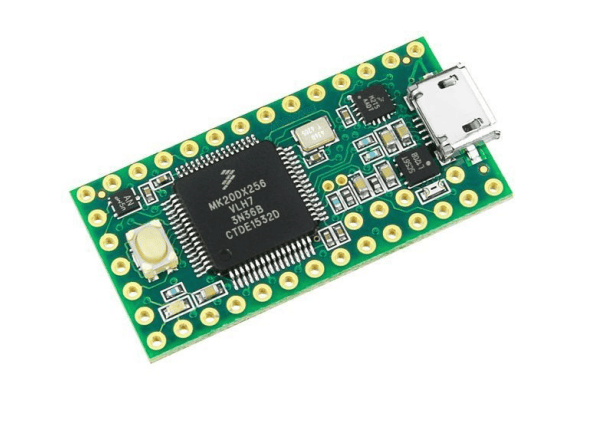
  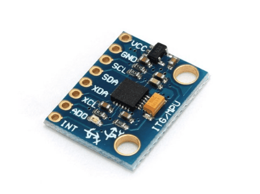
</div>

<div align="center">
  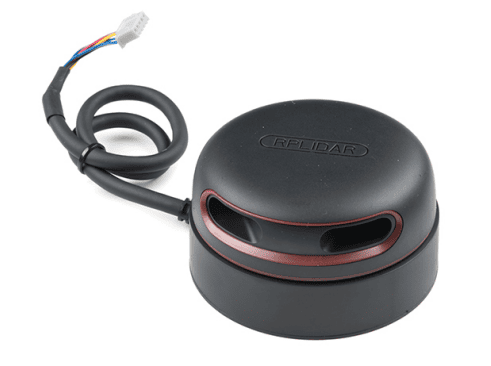
  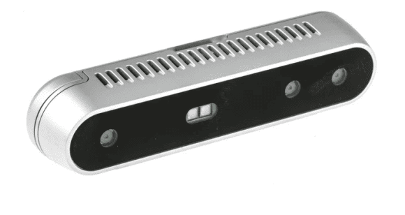
</div>

## 🔌 Circuit Design

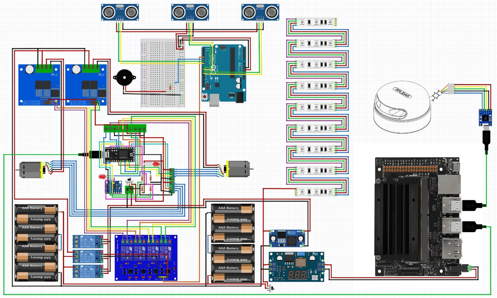

The power system runs from two 12V 7A lead acid batteries in parallel. Two buck converters split power into two branches:

- **Jetson branch** — Powers camera, speaker, microphone, and LIDAR via USB
- **PCB branch** — Powers the Teensy, MPU6050, motor relay, and LED relay via relay modules for safe high-current switching

The Arduino emergency stop is powered from a dedicated stable 5V rail on the PCB with reverse polarity protection. If any of the three ultrasonic sensors detects an obstacle within 30 cm, the relay cuts the motor driver control signal, immediately halting the motors.

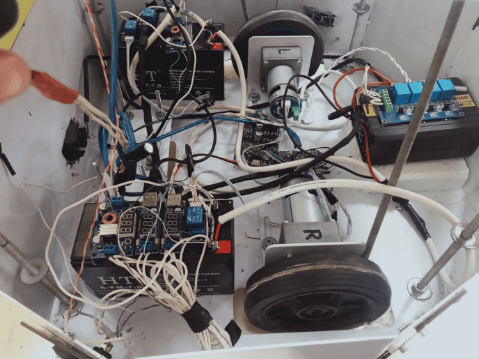

## 🟢 Single Button Boot

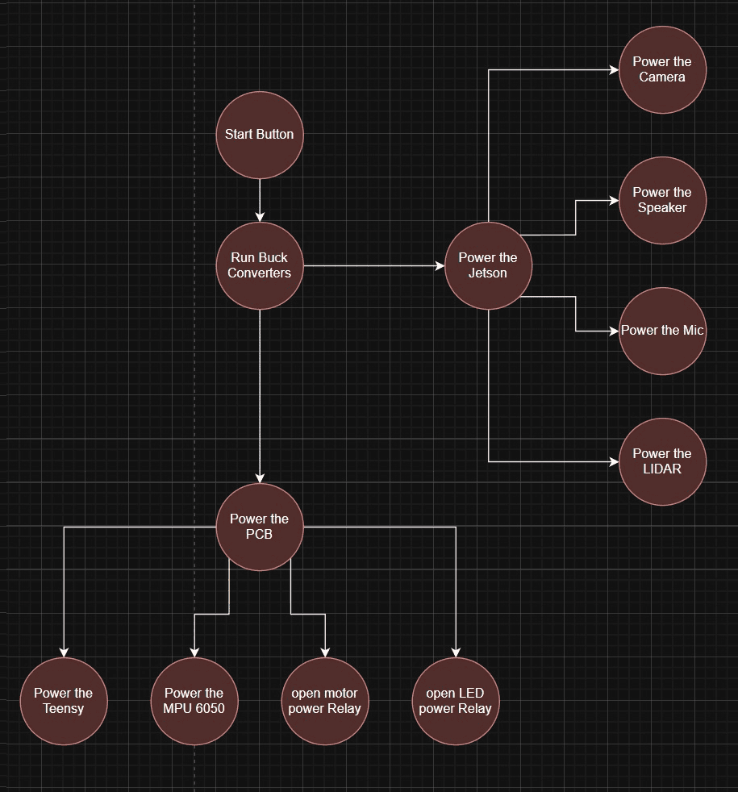

One button powers and sequences the entire robot:
1. Start button → Run buck converters
2. **Branch 1**: Power the Jetson → powers camera, speaker, mic, LIDAR
3. **Branch 2**: Power the PCB → powers Teensy, MPU6050, motor relay, LED relay

## 🧠 Firmware

### Teensy Firmware (`firmware.ino`)

The Teensy 3.2 runs a ROS Serial node (`nour_base_node`) that:
- Subscribes to `/cmd_vel` (`geometry_msgs/Twist`) from the Jetson
- Subscribes to `/pid` for live PID constant updates
- Publishes `/raw_vel` (`nour_msgs/Velocities`) — encoder-derived wheel velocities
- Publishes `/quaternion` — MPU6050 DMP quaternion output at 20 Hz
- Drives dual motor drivers using PWM + direction signals
- Implements per-wheel PID speed control (Kp, Ki, Kd tuned via step response tests)
- Reads encoders using interrupt-optimized library (`ENCODER_OPTIMIZE_INTERRUPTS`)
- Reads MPU6050 via DMP FIFO at 20 Hz over I²C with pull-up resistors on SDA/SCL

### Arduino Emergency Stop (`arduino_code.ino`)

Three HC-SR04 ultrasonic sensors on pins 7–12 poll distances every 200 ms. If any sensor reads below 30 cm, a HIGH signal on pin 4 activates the relay to cut motor driver control signals.

## 📡 ROS Nodes and Topics

| Node | Side | Key Topics |
|------|------|-----------|
| `Teensy 3.2 Node` | Teensy | Publishes: `raw_imu`, `raw_vel`; Subscribes: `cmd_vel`, `pid` |
| `Nour_Base_Node` | Jetson | Subscribes: `raw_vel`; Publishes: `raw_odom` |
| `pid_configure` / `pid_listener` | Jetson | `cmd_vel (Twist)`, `pid (nour_msgs::PID)` |
| `do_calib` / `apply_calib` | Jetson | IMU calibration pipeline |
| `rplidarNode` | Jetson | Publishes: `scan (sensor_msgs/LaserScan)` |
| `usb_cam_node` | Jetson | Publishes: `camera/image_raw` |
| `sound_play_node` | Jetson | Subscribes: `robotsound (sound_play/SoundRequest)` |
| `audio_capture` | Jetson | Publishes: `audio (AudioData)` |

Communication between Teensy/Arduino and the Jetson uses **ROS Serial** over USB.

## 🗺️ Autonomous Navigation

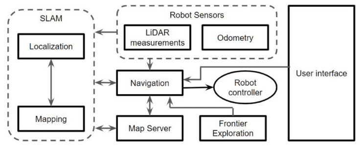

### Odometry
Wheel encoder velocities are fused with MPU6050 orientation data using an **Extended Kalman Filter** to produce robust `/odom` estimates, compensating for wheel slippage and system noise.

### SLAM — Gmapping
RPLIDAR A2M8 scan data combined with encoder+IMU odometry feeds **Gmapping** (ROS navigation stack) to build a 2D occupancy grid map of the environment. For long-term operation in a fixed indoor space, the static map is saved via `map_server` and **AMCL** (Adaptive Monte Carlo Localization) is used for localization on the saved map.

### Path Planning
- **Global planner** — `move_base` global planner (A* with quadratic approximation), publishes `/plan` visualizable in RViz
- **Local planner** — Dynamic Window Approach (DWA), generates collision-free velocity commands on `/cmd_vel` while tracking the global plan

### Testing
The robot was tested in the IRES lab at Zewail City. It successfully built a static 2D map, localized itself on the map, planned collision-free paths to goal points, and avoided dynamic obstacles using the LIDAR. DWA local planner and NavFN showed comparable performance.

## 🎥 Demo Videos

The `videos/` folder contains:
- `video_robot_moving_demo.mp4` — Robot moving autonomously
- `video_lidar_testing_seeing_lab_S002.mp4` — LIDAR mapping the lab environment
- `video_lidar_testing_by_hand_covering.mp4` — LIDAR obstacle detection test

## 📁 Repository Structure

```
nour-robot-embedded-navigation/
├── firmware.ino              # Teensy 3.2 ROS firmware (motors, encoders, IMU, PID)
├── arduino_code.ino          # Arduino emergency stop (ultrasonic sensors + relay)
├── images/                   # Hardware and system diagram images
└── videos/                   # Demo and testing videos
```

## 🚀 Getting Started

**Requirements:**
- Teensy 3.2 with Teensyduino + Arduino IDE
- ROS Melodic on Nvidia Jetson (Ubuntu 18.04)
- `rosserial`, `rosserial_arduino` packages
- `nour_msgs` custom message package
- `gmapping`, `amcl`, `move_base`, `rplidar_ros` ROS packages

**Flash firmware:**
```bash
# Upload firmware.ino to Teensy 3.2 via Arduino IDE with Teensyduino
# Upload arduino_code.ino to Arduino UNO

# Launch ROS Serial bridge on Jetson
rosrun rosserial_python serial_node.py /dev/ttyUSB0 _baud:=57600
```

## 🤝 Contributing

Contributions are welcome! Feel free to improve the PID tuning, extend the ROS node interface, or add new sensor integrations.

## 🙏 Acknowledgments

- Zewail City of Science and Technology — IRES Lab
- NOUR Robot senior project team
- Supervisor: Dr. Moustafa Elshafei

<br>
<div align="center">
  <a href="https://codeload.github.com/TendoPain18/nour-robot-embedded-navigation/legacy.zip/main">
    
  </a>
</div>

## <!-- CONTACT -->
<!-- END CONTACT -->

## **Building intelligent robots that navigate, sense, and interact with the world! 🤖✨**

